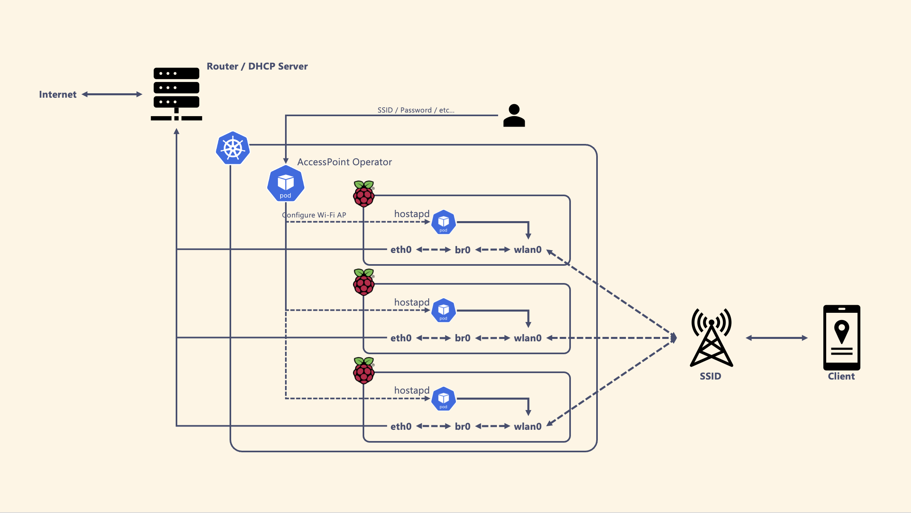
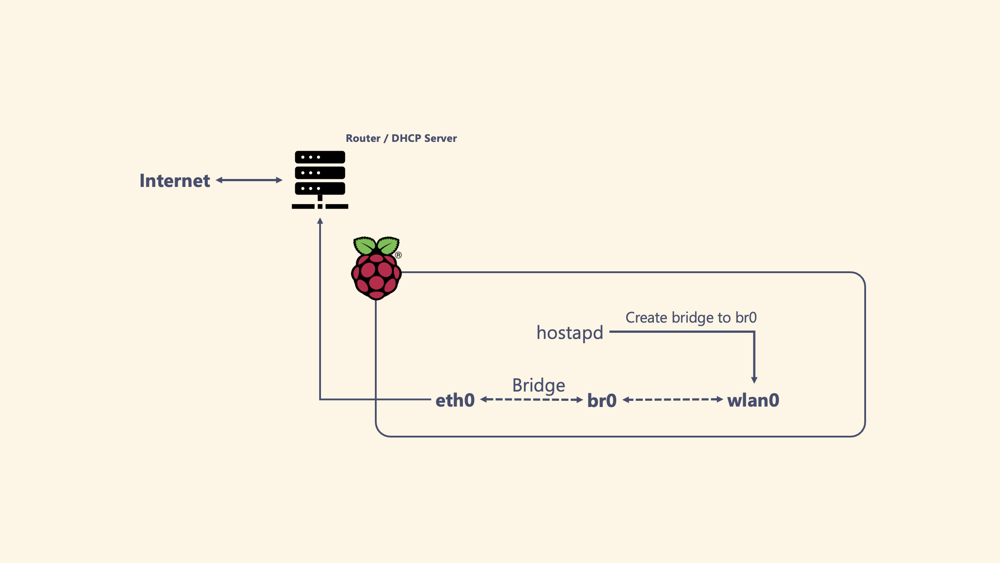

AccessPoint Operator
===

AccessPoint Operator is a Kubernetes Operator build by Kubebuilder for managing Accesspoints.



**NOTE**
This project is under ALPHA version. 
DO NOT USE THIS OPERATOR IN ANY PRODUCTION ENVIRONMENTS.

## Quick Start

Make sure your node satisfied the [prerequirements](#prerequirements).

```bash
# Install CRD
❯ kubectl apply -f config/crd/bases

# Install Namespace, RBAC, and Operator
❯ kubectl apply -f config/samples/operator.yaml

# Label to nodes where you want to deploy Accesspoint
❯ kubectl labels nodes XXX accesspoint=sample

# Deploy Accesspoint to your cluster!
❯ kubectl apply -f config/samples/accesspoint_v1alpha1_accesspoint.yaml
```

## Prerequirements
- Your Node to deploy accesspoints has wireless network interface.
- The network where the wireless interface belongs has an active DHCP server.
  - This operator DOES NOT deploy any DHCP server. You need to prepare it in your network.

## Tested Environment
- Node : Raspberry Pi 4 Model B/8GB, Ubuntu 20.04
- Wireless Network Interface : `wlan0`
- Bridge : `br0` that connects the network interface `eth0`. Also make sure `eth0` belongs to the network where DHCP server assigns IP addresses.


